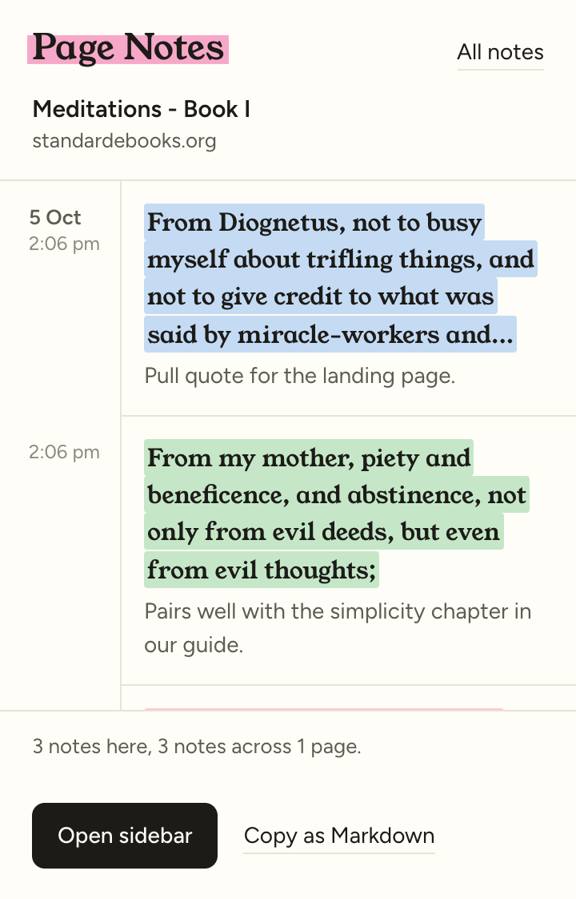
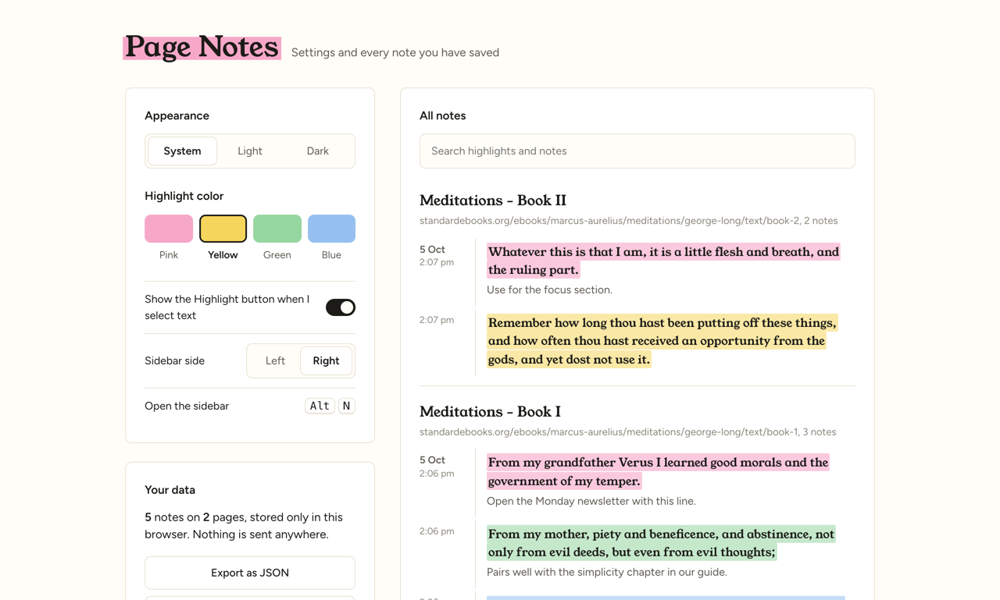
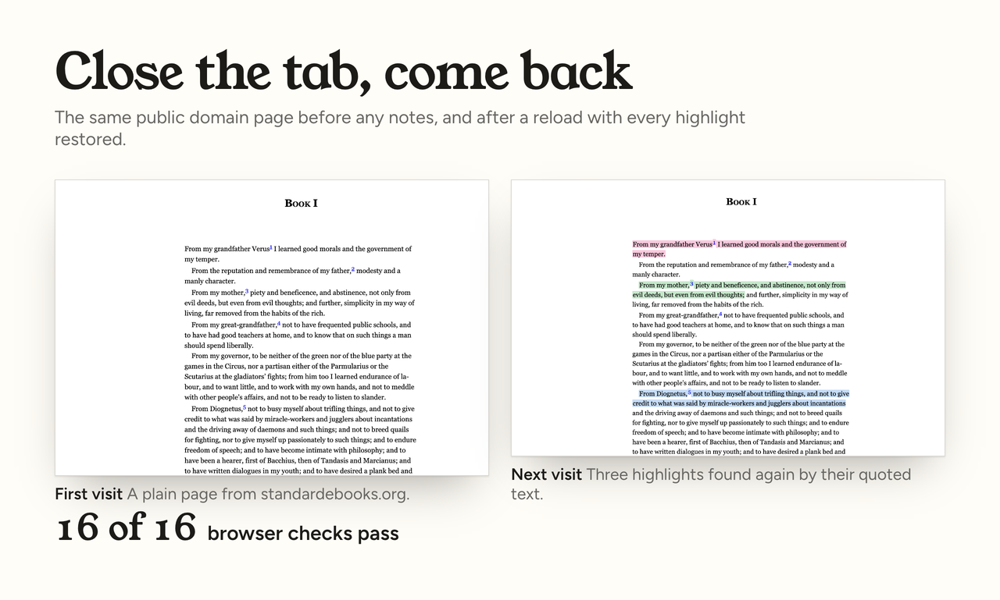

# Page Notes (sample Chrome extension)

Page Notes is a Manifest V3 Chrome extension that lets you highlight text on any web page, add a note, and see your highlights again every time you come back. Select text and click Highlight or Add note, or use the right-click menu. The in-page sidebar (Alt+N, docks left or right) lists and edits every note. The toolbar popup reads like a notebook page, with a date gutter and each note as a quote; it shows a count badge and copies the page's notes as Markdown. The settings page follows the system light or dark mode (or lets you pick), offers four highlight colors, searches across all notes, and exports and imports JSON. Highlights are re-anchored after a reload by matching the quoted text plus its surrounding context, so they survive page changes better than saved positions.

To try it, open `chrome://extensions`, turn on Developer mode, click "Load unpacked" and choose the `extension` folder, or unzip `dist/page-notes-1.2.0.zip`. `npm install && npm test` loads the real extension in Chromium with Playwright, uses it on a public domain book on standardebooks.org, and runs 16 checks: creating, storing, badge count, restoring after reload, deleting, re-adding, the popup with notes, empty and on a page it cannot use, settings, dark mode and sidebar docking.

The extension asks only for `storage`, `contextMenus` and `activeTab`, stores notes locally in the browser, and makes no network requests. This is a demo build made to show the kind of extension work I do.

Fonts: Young Serif and Figtree, both under the SIL Open Font License (`extension/fonts/LICENSE.txt`).

