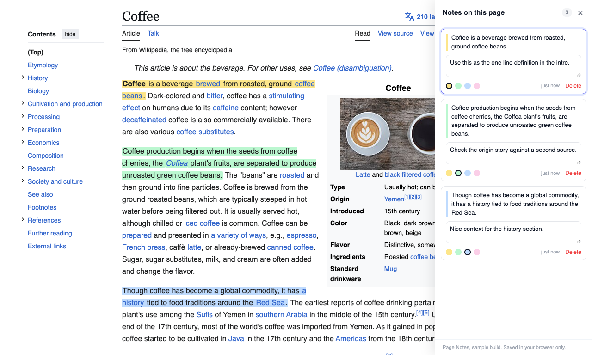
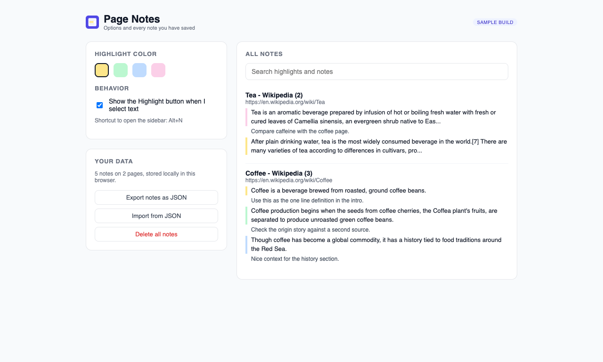
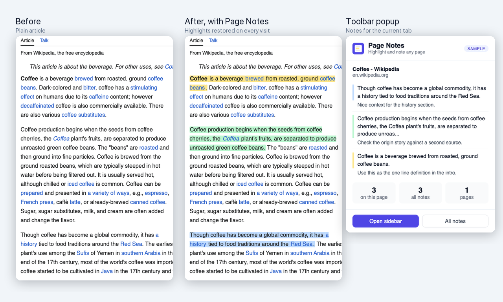

# Page Notes (sample Chrome extension)

Page Notes is a Manifest V3 Chrome extension that lets you highlight text on any web page, attach a note, and see your highlights again the next time you open that page. Select text and click Highlight or Add note, or use the right-click menu; a sidebar (Alt+N) lists every note on the page, and the options page searches all notes, picks the default color, and exports or imports them as JSON. Notes are stored locally with `chrome.storage`, and highlights are re-anchored on reload by matching the quoted text plus its surrounding context.

To try it, open `chrome://extensions`, turn on Developer mode, click "Load unpacked" and choose the `extension` folder (or unzip `dist/page-notes-1.0.0.zip`). `tests/e2e_screenshots.js` drives the real extension in Chromium with Playwright, creates notes on a Wikipedia page, reloads to check that they restore, and captures the screenshots in `screenshots/`.

This is a demo build made to show the kind of extension work I do. It collects no data and makes no network requests.

